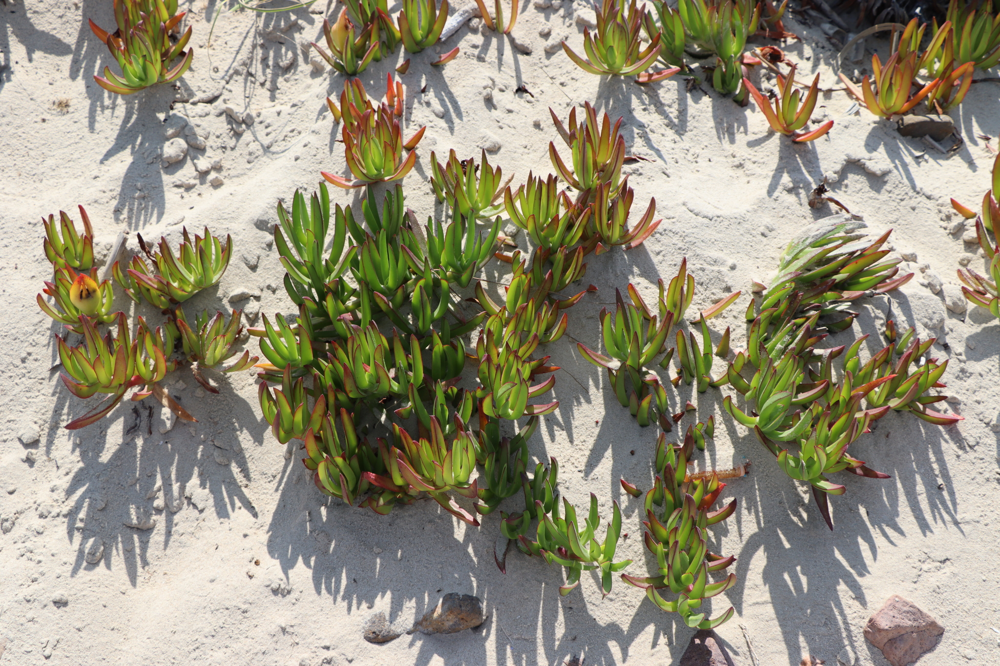

# Carpobrotus edulis en Uruguay

*Gabriel Laufer, Florencia Grattarola, Lucía Rodríguez-Tricot & Matías Zarucki*.

Este repositorio contiene datos, código y análisis de registros de *Carpobrotus edulis* en NaturalistaUY. La descarga de datos, está automatizada a través de la API de iNat.

**El código de los análisis y las figuras pueden visualizarse aquí: [Análisis de la invasión de *Carpobrotus edulis* en Uruguay](https://bienflorencia.github.io/carpobrotus-uruguay/code/carpobrotus-uruguay.html)**

Este trabajo está disponible bajo [licencia CC-BY](https://creativecommons.org/licenses/by/4.0/deed.es). Si usás este código para su trabajo, citá nuestro pre-print en revisión en *Biological Invasions*:

Grattarola F., Rodríguez-Tricot L., Zarucki M., and Laufer G. (2023) Status of the invasion of Carpobrotus edulis in Uruguay based on community science records, PREPRINT (Version 1) available at Research Square [https://doi.org/10.21203/rs.3.rs-3185397/v1](https://doi.org/10.21203/rs.3.rs-3185397/v1)

Foto: Florencia Grattarola con licencia [CC BY](http://creativecommons.org/licenses/by/4.0/), via [NaturalistaUY](https://www.naturalista.uy/observations/38173952).
